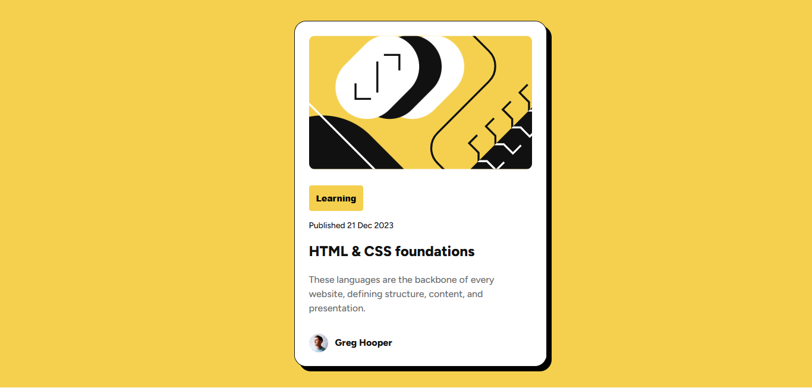

# Frontend Mentor - Blog preview card solution

This is a solution to the [Blog preview card challenge on Frontend Mentor](https://www.frontendmentor.io/challenges/blog-preview-card-ckPaj01IcS). Frontend Mentor challenges help you improve your coding skills by building realistic projects. 

## Table of contents

- [Overview](#overview)
  - [The challenge](#the-challenge)
  - [Screenshot](#screenshot)
  - [Links](#links)
- [My process](#my-process)
  - [Built with](#built-with)
  - [What I learned](#what-i-learned)
  - [Useful resources](#useful-resources)
- [Author](#author)

## Overview

Based on what i've learned i have implemented the use of css grid and flexbox, using root, variables, fonts and native css nesting.

### The challenge

So far the most tricky part of this challenge is the box shadow, moving shadows with an effect of flicker opacity 0 to 1 while moving in the middle of transition

### Screenshot

The screenshot was generated with awesome screenshot browser plugin.

### Links

- Solution URL: [https://github.com/mav1283/responsive-blog-preview-card](https://github.com/mav1283/responsive-blog-preview-card)
- Live Site URL: [https://mav1283.github.io/responsive-blog-preview-card/](https://mav1283.github.io/responsive-blog-preview-card/)

## My process

- I started with the HTML5 semantics, getting the exact tags or containers for each part or components
- Combine the powers of flexbox and css grid to align and set things according the figma design
- Add external css for the reset, variables and fonts
- Use the figma design as reference by examining each component and knowing their properties.

### Built with

- Semantic HTML5 markup
- CSS custom properties
- Flexbox
- CSS Grid
- Mobile-first workflow

### What I learned

Investigating each component in the figma design especially the preset fonts which was tricky at first since you can't see the font sizes.

### Useful resources

- Eric Meyer's CSS Reset: [cssreset](https://meyerweb.com/eric/tools/css/reset/)
- Awesome screenshot: [awesomescreenshot](https://www.awesomescreenshot.com/)
- W3Schools: [w3schools](https://www.w3schools.com/)

## Author

- Frontend Mentor - [@mav1283](https://www.frontendmentor.io/profile/mav1283)

